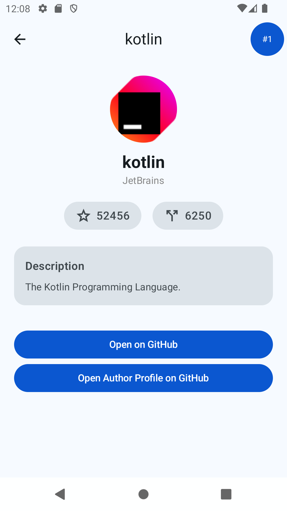

# Kotlin Stars

Android application that lists the most starred Kotlin repositories on
GitHub.

The app fetches repositories from the GitHub Search API and displays
them in a paginated list. Selecting a repository opens a detail screen
with additional information.

The project was built as a technical exercise and focuses on code
organization, testability, and separation of concerns.

------------------------------------------------------------------------

# Screenshots

| Repository List           | Repository Details           |
| ------------------------- | ---------------------------- |
|  |  |

------------------------------------------------------------------------

# Features

-   List most starred Kotlin repositories
-   Infinite scrolling using Paging 3
-   Repository details screen
-   Offline cache using Room
-   Basic error handling and retry support

------------------------------------------------------------------------

# Tech Stack

-   Kotlin
-   Jetpack Compose
-   Paging 3
-   Room
-   Retrofit
-   Koin (Dependency Injection)
-   Coroutines / Flow
-   JUnit & Compose UI tests

------------------------------------------------------------------------

# Architecture

The project follows a layered architecture inspired by Clean
Architecture, with MVVM used on the presentation side.

The goal is to keep business logic separated from framework code and
make components easier to test.

    UI (Compose)
        │
    ViewModel
        │
    Domain
        │
    Repository Interface
        │
    Data Layer
     ├── Remote (GitHub API)
     └── Local (Room cache)

Each layer has a specific responsibility.

------------------------------------------------------------------------

## UI Layer

The UI is written with Jetpack Compose.

It is responsible only for rendering state and forwarding user
interactions to the ViewModel.

    ui/
     ├── component
     ├── repositorylist
     ├── repositorydetails
     ├── navigation
     └── theme

UI components are kept small and reusable where possible.

------------------------------------------------------------------------

## ViewModels

ViewModels coordinate between the UI and the repository layer.

They expose state objects that represent what the UI should display.

Example:

    RepositoryListViewModel
    RepositoryDetailsViewModel

State is represented using sealed classes to make loading, success, and
error states explicit.

------------------------------------------------------------------------

## Domain Layer

The domain layer contains the core models used throughout the app.

    domain/
     ├── model
     ├── repository
     └── error

These classes are independent of Android framework code.

------------------------------------------------------------------------

## Data Layer

The data layer handles retrieving and caching repository data.

    data/
     ├── remote
     ├── local
     ├── mediator
     ├── paging
     ├── repository
     └── mapper

The app uses Paging 3 with RemoteMediator to combine network and local
storage.

Flow:

    GitHub API
         │
    RemoteMediator
         │
    Room Database
         │
    PagingSource
         │
    UI

This allows the list to be paginated while caching results locally.

------------------------------------------------------------------------

# Testing

The project includes both unit tests and UI tests.

Unit tests cover:

-   mappers
-   repository implementation
-   RemoteMediator
-   ViewModels
-   utilities

Compose UI tests cover:

-   reusable UI components
-   list and detail screen content

Test fixtures are used to avoid repeating setup logic.

------------------------------------------------------------------------

# Running the project

Clone the repository:

    git clone https://github.com/gabriel-lins-ds/kotlin-stars.git

Open it in Android Studio and run the `app` module.

The project uses the public GitHub API and does not require
authentication.

------------------------------------------------------------------------

# Notes

GitHub's search API limits unauthenticated requests and caps results to
1000 repositories. This application works within those limits.

------------------------------------------------------------------------

# License

This project is for demonstration purposes.
